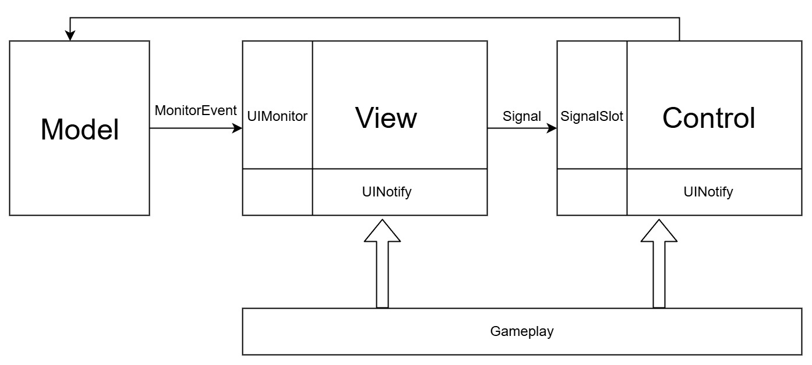
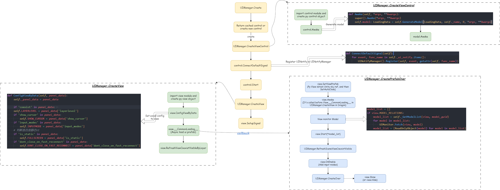

(prefab 添加python文件 导表 )创建UI
写MVC控制
# 各种通知机制
1. 每个 View 在初始创建时，会装载一个 Signal 实例，通过 Signal 可以给 Control 传递消息。
2. 另外 Signal 也有连接的功能，从而实现与其它 View 对应的 Control 的连通关系。

Model
UI 的数据类，针对 Gameplay 层数据的封装。将 Gameplay 的数据转换成 UI 面板所需显示的数据。
```python
class TaskDetailData(Model):

    def Awake(self, *args, **kwargs):
        super().Awake(*args, **kwargs)

        self.current_selected_mission = sgr_enum.TaskMission.ALL
        self.current_selected_task_id = None
        self.current_task_data = None

        self.task_mission_info = {}

        self._InitTaskTypeInfo()

        task_id = game_mgr.player.tracking_task
        if task_id:
            task_mission = data_mgr.FindDesignDataById('TaskData', task_id, 'mission_type')
            if task_mission == sgr_enum.TaskMission.HIDE:
                task_id = None

        if not task_id:
            task_id = self._GetTaskIDByIndex(0)
        self._UpdateCurrentTask(task_id)
```

MonitorEvent
~~其实最早的设计方案，是 View 监听 Model 字段的修改，然后触发 View 的刷新，主要像表达 View 是一种被动监听，Gameplay 层的目的是改变 Model 的值，而非关心 View 的显示，从而真正的把 Gameplay层的逻辑与UI界面显示拆开。
但这种方式在实际应用中会有一些问题，例如多字段修改后，触发多次 View 刷新。另外，一个字段的修改很难辨别其具体缘由并做对应的UI表现。~~
所以考虑是否引入 MonitorEvent 的方式：
```python
class BackpackData(Model):
    def Awake(self, *args, **kwargs):
        super().Awake(*args, **kwargs)
        self.selected_id = None
        self.sort_type = ListSortType.LEVEL_DOWN
        self.item_lst = []
        
    @MonitorEvent
    def SelectItemID(self, item_id):
        self.selected_id = item_id
```
**Model 通过方法设置选中ID，并加上 @MonitorEvent 修饰符即完成所有的事。**
View 层如果对此感兴趣：
```Python
class View(BaseView):
    ......
    @UIMonitor(BackpackData.SelectItemID)
    def OnSelectItemID(self, model):
        ......
```
**经过 UIMonitor 修饰的 View 方法在完成Model层的调用后，会被接着调用。参数就是 BackpackData 的实例对象，用此来完成 View 层的变化修改。**


基本套路：
```Python
# GamePlay 创建UI
game_mgr.ui_mgr.Create("test")

# GamePlay 通知UI
game_mgr.ui_mgr.Notify("DoSomething", ctrl_name=xx, guid=xx) # 可通知特定UI

#------------------------Stand MVC------------------------
# main_control.py
class Control(BaseControl):
    @UINotify("DoSomething")
    def DoSomething(self):
        """
        gameplay call ui control
        """
        self.model.ChangeData()

    @SignalSlot("BtnClick")
    def BtnClick(self):
        """
        communicate with gameplay
        """
        pass

# main_model.py
class SampleData(Model):
    @MonitorEvent
    def ChangeData(self):
        """
        change data logic
        """
        pass

# main_view.py
class View(BaseView):
    MODEL_RELATIONS = (SampleData,)

    def Start(self, model: SampleData):
        self.model = model
        self.btn = self.FindUITrigger("xxx")
        self.btn.OnClick(lambda _: self.SignalEmit("BtnClick"))

        self.CreateSubView("my_subview", self.FindNode("xxx"))
        self.CreateWidget("widget.tiny_widget", self.FindNode("yyy"))

    @UIMonitor(SampleData.ChangeData)
    def RefreshData(self, model: SampleData):
        """
        data change trigger view change logic
        """
        pass

#------------------------SubView------------------------
# my_subview.py
class View(BaseSubView):
    MODEL_RELATIONS = (SampleData,)

    def Start(self, model: SampleData):
        pass

#------------------------Widget------------------------
# widget/tiny_widget/main_control.py
class Control(BaseSubControl):
    pass
class WidgetModel(Model):
    pass
class View(BaseSubView):
    pass

```
1. MVC逻辑链写法
- GamePlay->Control：game_mgr.ui_mgr.Notify通知到Control里被@UINotify装饰的函数
- Control->Model: Control持有对应的model，直接self.model.xxx来修改数据
- Model->View: Control调用到Model里被@MonitorEvent装饰的函数（里面通常是修改数据的逻辑）后，View里被@UIMonitor装饰的函数（里面通常是修改界面显示的逻辑），就会自动调用
- View->Control: View通常会把玩家操作交互逻辑转发到Control处理，View里self.SignalEmit会通知到Control里被@SignalSlot装饰的函数(函数 view 信号 --> control槽函数)
- 通常对于一些不改变数据的简单界面表现，比如播个动画，也支持Control->View：在Control里，self.Notify通知到View里被@UINotify装饰的函数（有个潜规则，这个Notify不能传额外参数）
以上的逻辑链写法需要新同学参考项目现有代码进行理解



# UI框架
1. 最小节点，对应某种UI控件: `Node`
2. 根据项目需求所封装的一些通用的部件（Widget），对应的是 UI 封装的一些通用的 prefab。
## Panel
Panel 即我们在游戏中经常使用到的交互面板，负责输入、信息展示、输出。
## view
[create-->awake->加载资源-->start,,close-->destroy](https://iitkra4fu8q.feishu.cn/wiki/YfcUwwLQIijuFSkfMMDc2u9Onhb)

### Subview
```python
# main_view.py
from xgui.framework.view import BaseView

class View(BaseView):
    MODEL_RELATIONS = (RoguelikeData,)

    def Start(self, model: RoguelikeData):
        ...
        self.CreateSubView("weekely_reward_view", self.FindGameObj("root/content/weekly_reward"))

# main_view的同级目录下创建subview文件weekely_reward_view.py来写对应周结算的界面了逻辑
# weekely_reward_view.py
from xgui.framework.subview import BaseSubView

class View(BaseSubView):
    MODEL_RELATIONS = (RoguelikeData,)

    def Start(self, model: RoguelikeData):
        ...
```
>- 继承的基类分别为 BaseView 和 BaseSubView 
>- 一般会共享相同的model实例, 即MODEL_RELATIONS里设置相同的关联Model类
>- subview一般只在当前main_view使用
## widght
封装可复用的界面组件，有独立的MVC类
```python

# main_control.py
class Control(BaseControl):
    def Foo(self):
        # notify widget control and view
        self.NotifyWidget("widget.dungeon_switch", "DoSomething")

# main_view.py
class View(BaseView):
    MODEL_RELATIONS = (RoguelikeData,)

    def Start(self, model: RoguelikeData):
        self.dungeon_widget = self.CreateWidget(
            "widget.dungeon_switch",
            self.FindGameObj("root/content/c_dungeon_switch"
        )
        #  Widget中control和view里被UINotify装饰的代码, 都可以被上层通知到
        # notify widget control and view
        self.dungeon_widget.Notify("DoSomething")
        # only notify view
        self.dungeon_widget.NotifyView("DoSomething")
    )

# <<========================== widget ==========================>>
# ui/widget/dungeon_switch/main_control.py
class Control(BaseControl):
    @UINotify("DoSomething")
    def Foo(self):
        pass

# ui/widget/dungeon_switch/main_view.py
class View(BaseSubView):
    @UINotify("DoSomething")
    def Bar(self):
        pass
```
>- Widget的View也要从 BaseSubView 继承
>- Widget中control和view里被UINotify装饰的代码, 都可以被上层通知到

# 加载
>- 我们的Prefab资源全部都是异步加载的
>    - 所以main view里, View.Start会在资源异步加载结束后回调到, 请在这里面(和之后)去Find控件,以及做View逻辑
>    - 在View.Start之前就要准备好数据存在model里, View.Start去读取model数据, 做初始化的界面展示
>- CreateSubView/CreateWidget 是同步的
>    - 这俩都是在View.Start里把已经加载和创建好的子节点传进去包装一下而已
>    - 所以这里面的Awake/Start函数都是同步的, 在一个调用栈内

### ReadOnlyObject
在 View 中，需要读取 Model 上的数据，进行界面展示，但 View 获取到 model 后，可能会导致在 View 中对 Model 的误修改，所以在 View 获取的 Model 上做了另一层封装：ReadOnlyObject，在读取上与原生的 Model 调用接口没有任何区别，只是在执行 Model 写入操作的时候，会报错。




